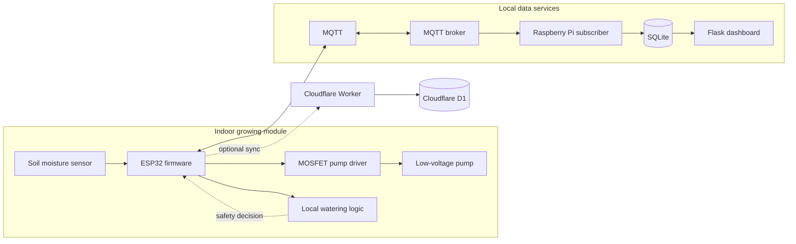
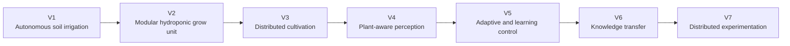

# petrichor

> *petrichor* — the smell of rain on dry soil.

Petrichor is a safety-first platform for autonomous plant cultivation. It is designed to
evolve from a single autonomous irrigation system into a modular, distributed, plant-aware
cultivation platform for controlled indoor environments.

V1 is an autonomous soil-irrigation module for one indoor potted plant. The project combines
embedded systems, robotics, sensing, deterministic control, distributed software,
experimental data, and eventually machine learning. The long-term system is intended to
support hydroponic growing, heterogeneous modules, plant-state perception, adaptive control,
and autonomous experimentation.

The repository currently contains:

- host-tested ESP32 watering and safety logic
- an ESP32 target build for the real hardware
- a documented MQTT, JSON, and SQLite contract
- a Raspberry Pi subscriber and Flask dashboard
- a deterministic fake-data and fake-device development path
- optional Cloudflare Worker and D1 ingestion
- data analysis and publication guidance

## Architecture



The local watering decision does not depend on Wi-Fi, MQTT, the Raspberry Pi, the dashboard,
or the cloud. Those services add observability and control without becoming a safety
dependency.

Five topics carry everything: `garden/sensor/moisture`, `garden/pump/command`,
`garden/pump/status`, `garden/pump/ack`, `garden/device/status`. Three tables store it:
`readings`, `watering_events`, `device_status`.

Nothing enforces agreement between the C++ and the Python — no shared types, no compiler,
no test spanning both. **[`SPEC.md`](SPEC.md) is the contract**: topics, JSON payload
shapes, units, and the SQLite schema. Change a field name or a unit there in the same
commit as the code, and treat any drift between spec and code as a bug.

## Watering logic

The pump is not a timer. The firmware decides locally, so a dead broker or dead WiFi never
means a dead garden — and never means a flood either:

- **Threshold** — water when moisture drops below 30%, in fixed 10-second runs.
- **Hysteresis** — after a run the controller disarms, and won't trigger again until
  moisture has recovered past 35%. A sensor hovering at the threshold can't chatter the
  relay.
- **Cooldown** — at least 15 minutes between runs; water takes time to reach the sensor.
- **Schedule window** — only between 06:00 and 20:00 local, max 4 runs per day.
- **Safe default** — the relay is driven off on boot, on watchdog reset, and on any
  unexpected state. Off is always the failure mode.

These values are placeholders in [`firmware/include/config.h`](firmware/include/config.h),
untuned against real soil. They are loaded from ESP32 Preferences at boot so they can be
changed without reflashing, with the compile-time values used as defaults.

## Layout

| Path | What's in it |
|---|---|
| `SPEC.md` | The firmware ⇄ dashboard contract. Read before changing anything that crosses the wire. |
| `firmware/` | PlatformIO / Arduino ESP32 firmware. Hardware calls isolated behind a HAL; decision logic is pure C++ and unit-tested on the host. |
| `dashboard/` | Flask app, read-only SQLite data-access layer, Chart.js frontend. |
| `data/` | SQLite schema and the fake-data generator used in place of live MQTT. |
| `cloud/` | Cloudflare Worker and D1 service for optional indoor data ingestion and the public status page. |
| `docs/` | Design specs, implementation plans, and the [data analysis and publication plan](docs/data-analysis-and-publication.md). |

## Quickstart

Firmware:

```bash
pip install platformio
cd firmware
cp include/secrets.h.example include/secrets.h   # fill in WiFi and broker credentials
python -m platformio test -e native     # host unit tests (31 cases)
python -m platformio run -e esp32dev    # compile-only check for the real target
```

Dashboard:

```bash
python -m venv .venv
.venv/Scripts/python.exe -m pip install -r dashboard/requirements.txt  # Windows
# source .venv/bin/activate && pip install -r dashboard/requirements.txt  # macOS/Linux
python data/generate_fake_data.py       # builds data/garden.db — 7 days of fake history
python dashboard/app.py                 # http://127.0.0.1:5000
cd dashboard && ../.venv/Scripts/python.exe -m pytest  # Windows, 18 cases
# cd dashboard && python -m pytest                       # macOS/Linux with venv activated
```

Local development path:

```bash
# 1. Start an MQTT broker, e.g. Mosquitto, on localhost:1883.
# 2. Run the Pi subscriber in one terminal.
python dashboard/subscriber.py
# 3. Run the fake ESP32 in another terminal.
python data/fake_esp32.py
# 4. Send a pump command and wait for the ack.
python dashboard/commander.py --command run --duration 15
# 5. Open http://127.0.0.1:5000 after a few minutes of readings have accumulated.
```

## Engineering status

Every real-hardware call sits behind one named function marked HARDWARE SWAP POINT in its
header comment. The firmware README documents the hardware abstraction boundaries, while
the host tests cover the decision logic and safety behaviour.

On the Pi side, the dashboard only ever reads SQLite and has no idea who wrote the rows, so
replacing the fake-data generator with a real MQTT subscriber is a drop-in change — nothing
in `dashboard/` moves.

Production-hardening status:

- Application-level QoS 1 is implemented via `garden/pump/ack` and command `request_id`
  deduplication. True MQTT QoS 1 still requires switching from PubSubClient to a library
  that supports it.
- WiFi, MQTT broker, TLS, and OTA password credentials live in `firmware/include/secrets.h`,
  which is generated from `firmware/include/secrets.h.example` and gitignored.
- MQTT TLS is supported via `WiFiClientSecure`; configure it in `secrets.h`.
- Runtime configuration (thresholds, schedule, cooldown) is persisted to ESP32 Preferences.
- Timezone/DST is handled via a POSIX TZ string in `config.h`.
- OTA updates are handled by ArduinoOTA; set a password in `secrets.h`.

Known implementation limitations are kept in the relevant component documentation and issue
history rather than presented as the project's identity.

## Data analysis and publication

`data/garden.db` contains fake history for development and must not be presented as field
data. The publication plan defines the quality checks, descriptive statistics, watering
response measures, reliability metrics, inference limits, and versioned release workflow.
Real observations become publishable only after calibration, containment testing, and a
supervised indoor commissioning run. See
[`docs/data-analysis-and-publication.md`](docs/data-analysis-and-publication.md).

## Deployment roadmap

- **V1:** one indoor potted plant in potting mix, with a contained reservoir and tray.
- **V2:** indoor hydroponic module with a defined nutrient-solution sensor profile and
  corrosion-compatible liquid path.
- **V3:** distributed cultivation across heterogeneous indoor grow modules.

All versions remain indoors. The V1 soil-moisture contract does not cover hydroponic
chemistry. Hydroponics will add versioned measurements and calibration metadata rather than
reinterpret `moisture_pct`.

The broader direction is:



- **V3** introduces heterogeneous modules, capability discovery, standard interfaces,
  shared-resource coordination, and graceful degradation.
- **V4** adds computer vision and plant-state measurements such as canopy area, growth rate,
  morphology, colour, stress indicators, and developmental stage.
- **V5** applies machine learning to defined problems such as prediction, anomaly detection,
  parameter adaptation, and constrained policy optimisation.
- **V6** investigates transfer between modules, cultivars, and species.
- **V7** develops bounded autonomous experiments that connect interventions to plant response,
  resource use, and final outcomes.

Safety-critical limits remain deterministic and locally enforced at every stage.

## Resource efficiency and research direction

Resource efficiency should be optimised alongside plant health and useful cultivation output.
Future systems should account for water, nutrients, electricity, carbon intensity, space,
hardware, labour, waste, and system risk.

The long-term platform is intended to support research in distributed robotics, plant-aware
control, computer vision, safe learning, transfer between heterogeneous agents and crops,
fault-tolerant autonomy, multi-agent resource allocation, and autonomous experimentation.
