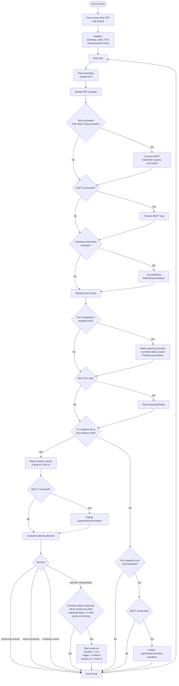
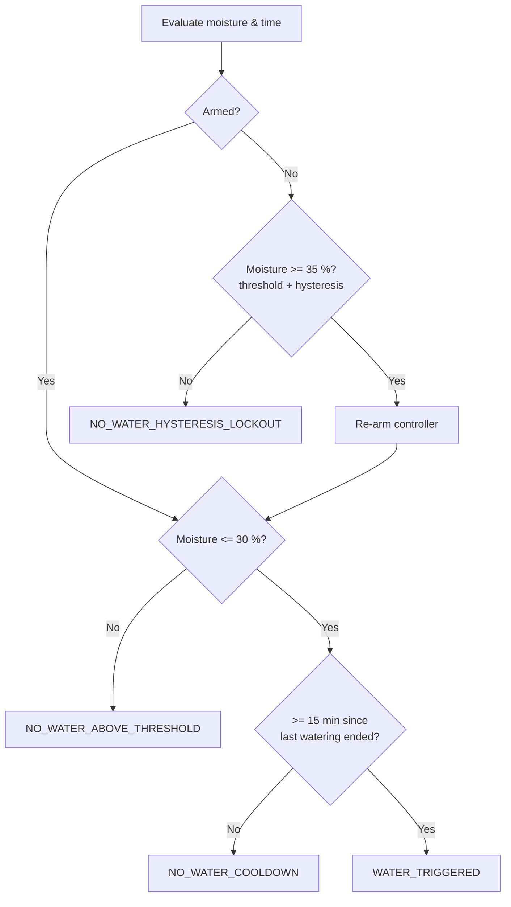
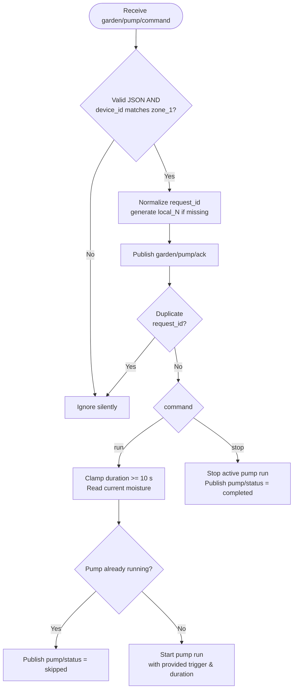

# Petrichor watering logic flow chart

These diagrams trace the firmware's behavior from boot through the main loop, including both autonomous moisture-triggered watering and remote MQTT commands.

---

## 1. Boot and main loop overview

---

## 2. Watering decision detail

---

## 3. MQTT pump command handler

---

## Key constants

| Constant | Value | Meaning |
|----------|-------|---------|
| `MOISTURE_THRESHOLD_PCT` | 30 % | Water when at or below this. |
| `MOISTURE_HYSTERESIS_PCT` | 5 % | Re-arm only after moisture rises to 35 %. |
| `COOLDOWN_PERIOD_SEC` | 900 | 15 minutes between runs. |
| `MIN_WATERING_DURATION_SEC` | 10 | Shortest automatic or clamped run. |
| `SCHEDULE_WINDOW_START_HOUR` | 6 | Earliest watering, 06:00 local. |
| `SCHEDULE_WINDOW_END_HOUR` | 20 | Latest watering, before 20:00 local. |
| `MAX_WATERINGS_PER_DAY` | 4 | Daily cap. |
| `MOISTURE_READ_INTERVAL_MS` | 10 000 | Sensor read/publish interval. |
| `HEARTBEAT_INTERVAL_MS` | 60 000 | Device health publish interval. |
